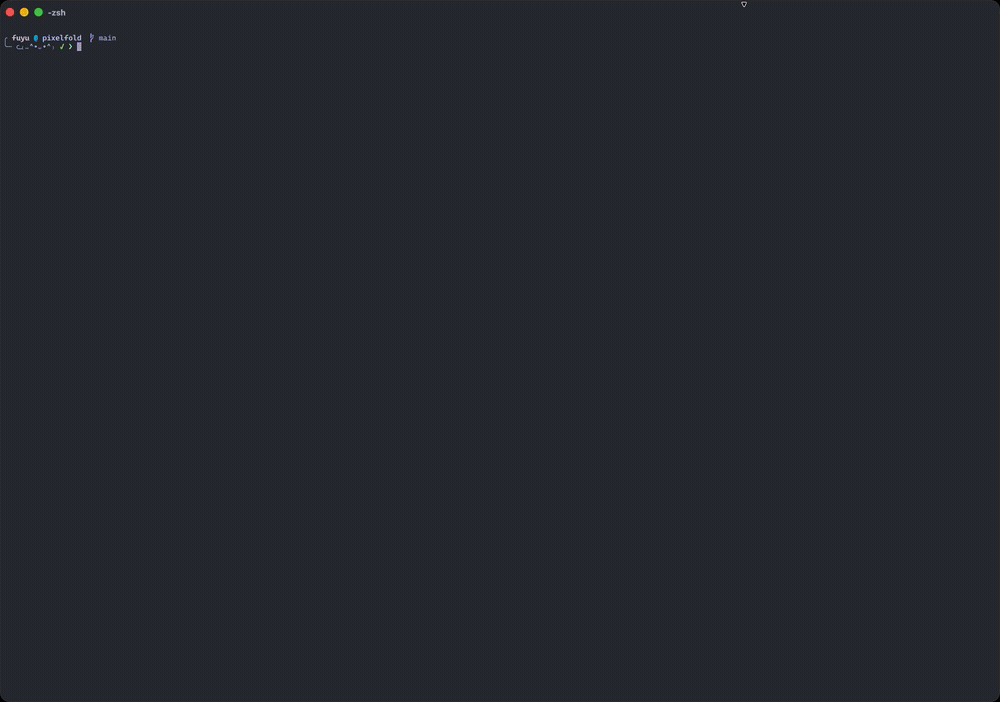

# PixelFold

[](https://github.com/fuyu-myk/pixelfold/actions/workflows/ci.yml)
[](https://opensource.org/licenses/MIT)

A terminal-based 3D protein structure viewer using Braille Unicode characters for high-resolution visualization.

## Demo



## Features

- **Braille Rendering**: Uses Unicode Braille characters (2×4 pixel resolution per character cell) for detailed protein structure visualization
- **PDB & mmCIF Support**: Parses both PDB and mmCIF/PDBx protein structure formats using `pdbtbx`
- **Interactive 3D Controls**: Rotate, zoom, and pan the protein structure in real-time
- **Surface Visualization**: Solvent-accessible surface with Kyte-Doolittle hydrophobicity coloring using the Shrake-Rupley algorithm
- **Hydrogen Bond Visualization**: Displays backbone H-bonds with energy-based color coding (cyan→yellow→orange)
- **H-Bond Network Analysis**: Graph-based analysis using `petgraph` to identify structural motifs, hubs, and connected components
- **Protein structure searching**: Ability to search for and download `.cif` files through the RCSB API

## Validation

Pixelfold's analyses are checked against reference implementations across a
stratified PDB benchmark: secondary structure against **DSSP 4**,
solvent-accessible surface area against **FreeSASA**, and non-covalent
interactions against **PLIP** across the 60 protein-ligand complexes.

<!-- VALIDATION:START -->
Validated 205 benchmark entries against DSSP 4, FreeSASA and PLIP.

| Metric | Reference | Entries | Result |
| --- | --- | --- | --- |
| Secondary structure (Q3) | DSSP 4 | 194 | 97.1% |
| Backbone H-bond edges (F1) | DSSP 4 | 205 | 0.97 |
| SASA mean abs error | FreeSASA | 202 | 4.93 A^2 |
| SASA median abs error | FreeSASA | 202 | 3.77 A^2 |
| SASA correlation (Pearson r) | FreeSASA | 202 | 0.99 |

Per-type interaction agreement (precision / recall / F1):

| Interaction type | Reference | Entries | Pred edges | Ref edges | Precision | Recall | F1 |
| --- | --- | --- | --- | --- | --- | --- | --- |
| hydrogen-bond | PLIP | 60 | 787 | 519 | 0.58 | 0.82 | 0.65 |
| salt-bridge | PLIP | 60 | 140 | 127 | 0.85 | 0.93 | 0.83 |
| hydrophobic | PLIP | 60 | 479 | 377 | 0.82 | 0.96 | 0.87 |
| pi-stacking | PLIP | 60 | 23 | 22 | 0.97 | 0.95 | 0.92 |
| pi-cation | PLIP | 60 | 6 | 17 | 0.97 | 0.88 | 0.84 |
| halogen-bond | PLIP | 60 | 4 | 5 | 1.00 | 0.98 | 0.98 |
| water-bridge | PLIP | 60 | 722 | 345 | 0.50 | 0.87 | 0.59 |
| metal-coordination | PLIP | 60 | 444 | 338 | 0.82 | 0.92 | 0.81 |
<!-- VALIDATION:END -->

Agreement is high on secondary structure, surface area, and the shape-driven
interactions (pi-stacking, halogen, pi-cation, hydrophobic, salt bridge, metal
coordination). It is
lower and directional on hydrogen bonds and water bridges, where pixelfold
reports every geometrically reachable bond (a rotatable donor placed against each
acceptor, one bridge per donor) while PLIP commits to one: recall stays high
(pixelfold finds what PLIP finds) and precision is where the modelling choice
shows. The residual SASA error is the same kind of difference: pixelfold uses
Bondi radii with Shrake-Rupley, FreeSASA uses ProtOr radii with Lee-Richards, and
where a residue is modelled in alternate conformers pixelfold keeps one whole
conformer (so a sidechain is never chimeric) while FreeSASA resolves each atom
independently. The per-residue correlation is still 0.99.

PLIP profiles ligand binding sites, so its numbers cover the 60 protein-ligand
complexes and each edge is scored only where it touches a ligand. RING 4.0 (the
whole-structure protein-protein reference) is a license-gated binary and is not
generated here; the harness reads its golden of the same shape once available.

Regenerate this table with `cargo run -p pixelfold-validate` (it prints the
markdown above). The harness compares against committed golden files under
`benchmarks/golden/` and runs on every PR, failing on regression past the gates
in `benchmarks/thresholds.toml`.

## Installation

Clone this repository, then install the `pixelfold` binary onto your `PATH`:

```bash
cargo install --path crates/pixelfold-cli
```

Or build it in place (the binary is written to `target/release/pixelfold`):

```bash
cargo build --release
```

## Usage

```bash
# Load and visualize a protein structure
pixelfold data/protein.pdb

# Or with mmCIF format
pixelfold data/protein.cif

# Or a 4-character PDB id, auto-downloaded from RCSB into the cache
pixelfold 1CRN
```

Everything the viewer computes is also available headless, for scripting and
pipelines:

```bash
# Non-covalent interactions, as a table
pixelfold interactions 1IEP --ligand STI

# One interaction type, as TSV to pipe onward
pixelfold interactions 4HHB --type salt-bridge --format tsv

# Secondary structure and solvent accessibility, per residue
pixelfold ss 1CRN
pixelfold sasa 1UBQ --format json

# The residue interaction network, for Cytoscape or Gephi
pixelfold rin 4HHB --format graphml -o net.graphml

# Any of them narrowed by the selection language
pixelfold interactions 1IEP --select 'byres within 4.5 of resn STI'
pixelfold rin 1IEP --select 'resn STI'
pixelfold sasa 4HHB --select 'chain A and ss H'
```

### Controls

#### Search mode

- **Enter**: Send a search query or download selected proteins
- **F1**: Clear the search bar
- **Esc**: Quit

#### Visualization mode

- **WASD**: Rotate the structure (W/S = pitch, A/D = yaw)
- **Z/X**: Roll rotation
- **+/-**: Zoom in/out
- **Arrow Keys**: Pan the view (or cycle through candidate atoms in inspect mode, or adjust surface density when surface is visible, or adjust H-bond threshold when H-bonds visible)
- **1/2**: Toggle display modes (1: All atoms (default); 2: Alpha carbon backbone)
- **F**: Auto-frame (reset and fit protein to view)
- **I**: Inspect-mode (interactive clicking enabled to view more information)
  - **Up/Down arrows** (upon clicking on an atom): Cycle between closest 5 atoms
- **R**: Toggle highlight amino acid (in inspect mode only)
- **C**: Toggle backbone connections
- **B**: Toggle b-factor coloring
- **V**: Toggle solvent-accessible surface visualization
  - **Note**: When surface is visible, atom rendering is disabled to show clear hydrophobicity patterns
  - **Up/Down arrows** (when surface visible): Adjust point density (100-500 points/atom)
- **H**: Toggle hydrogen bond visualization
  - **Dashed lines** colored by bond strength: cyan (weak, ~-0.5 kcal/mol) → yellow (medium, ~-2.0 kcal/mol) → orange (strong, ~-5.0 kcal/mol)
  - **Up/Down arrows** (when H-bonds visible): Adjust energy threshold (-0.1 to -10.0 kcal/mol)
- **N**: Toggle H-bond network analysis overlay
  - Shows connected components and hub residues
  - Displays network statistics in status bar
- **Q**: Quit

## Implementation Details

### Architecture

The project is a Cargo workspace of focused crates:

- [**`pixelfold-core`**](crates/pixelfold-core/src): pure analysis library, free of terminal and rendering dependencies
  - [`parser`](crates/pixelfold-core/src/parser.rs): loads PDB/mmCIF via `pdbtbx`, with alternate-location handling, backbone H-bond detection, and DSSP secondary-structure assignment
  - [`sasa`](crates/pixelfold-core/src/sasa.rs): solvent-accessible surface (Shrake-Rupley via `rust-sasa`), van der Waals radii, and Kyte-Doolittle hydrophobicity coloring
  - [`rin`](crates/pixelfold-core/src/rin.rs): residue interaction network over `petgraph` with degree centrality, connected components, and motif detection
  - [`assembly`](crates/pixelfold-core/src/assembly.rs): detects when the deposited coordinates are only part of the biological assembly

- [**`pixelfold-render`**](crates/pixelfold-render/src): scene projection and drawing
  - [`renderer`](crates/pixelfold-render/src/renderer.rs): orthographic projection, quaternion camera (rotate/zoom/pan, auto-framing), and depth sorting for atom occlusion
  - [`draw`](crates/pixelfold-render/src/draw.rs): Bresenham lines and b-factor/H-bond/hydrophobicity color mapping

- [**`pixelfold-fetch`**](crates/pixelfold-fetch/src): RCSB search and structure download
  - [`client`](crates/pixelfold-fetch/src/client.rs): async `reqwest` wrapper around the RCSB API
  - [`download`](crates/pixelfold-fetch/src/download.rs): concurrent download with `flate2` gzip decompression

- [**`pixelfold-tui`**](crates/pixelfold-tui/src): the `ratatui` front-end (Braille canvas, input handling, and the search interface, whose background threads report to the UI thread via `mpsc` channels)

- [**`pixelfold-cli`**](crates/pixelfold-cli/src): the `pixelfold` binary: argument parsing, a path/PDB-id resolver, and fetch-on-miss caching

### Why Braille?

Braille Unicode characters provide **8× higher resolution** compared to ASCII:

- Each terminal character cell can display 2×4 sub-pixels (8 dots)
- Excellent for visualizing protein density and structure detail
- Native support in `ratatui::widgets::canvas::Canvas` with `Marker::Braille`

### Dependencies

- **`ratatui`**: Terminal UI framework
- **`crossterm`**: Terminal manipulation
- **`pdbtbx`**: PDB and mmCIF parsing
- **`glam`**: 3D math library (vectors, matrices)
- **`petgraph`**: Graph data structures and algorithms for H-bond network analysis
- **`rust-sasa`**: Shrake-Rupley solvent-accessible surface calculation
- **`anyhow`**: Error handling
- **`tokio`**: Async calls for API interaction
- **`reqwest`**: API interaction
- **`flate2`**: Gz file decompresser

### Current limitations

**Color bleeding**: Due to how braille is rendered and colored, the colors of atoms in close proximity to each other may bleed into surrounding ones

- This is especially prevalent in inspect mode, where the atom is marked
- One workaround is to zoom in as much as possible to clearly distinguish which atom is marked

**Surface computation performance**: For very large proteins (>5000 atoms), surface calculation may take several seconds on load

- Surface computation uses the optimized `rust-sasa` library with parallel computation
- Use `--no-surface` flag to skip surface calculation and compute on-demand with 'V' key
- Surface points are computed once and cached for the session

## Example Workflow

1. Search and download protein structure(s) using `pixelfold -f`
2. Run PixelFold with the file: `pixelfold 1CRN`
3. Use WASD to rotate and explore the structure
4. Press F to auto-frame the view
5. Press H to visualize hydrogen bonds
6. Use up/down arrows to adjust H-bond energy threshold
7. Press N to analyze H-bond network topology
8. Press V to toggle surface visualization
9. Use up/down arrows to adjust surface point density
10. Use +/- to zoom in on specific regions

## Citations

```bibtex
@article{Kabsch1983,
  author = {Kabsch, Wolfgang and Sander, Christian},
  title = {Dictionary of protein secondary structure: Pattern recognition of hydrogen-bonded and geometrical features},
  journal = {Biopolymers},
  volume = {22},
  number = {12},
  pages = {2577--2637},
  year = {1983},
  doi = {10.1002/bip.360221211}
}

@article{Kyte1982,
  author = {Kyte, Jack and Doolittle, Russell F.},
  title = {A simple method for displaying the hydropathic character of a protein},
  journal = {Journal of Molecular Biology},
  volume = {157},
  number = {1},
  pages = {105--132},
  year = {1982},
  doi = {10.1016/0022-2836(82)90515-0}
}

@article{Bondi1964,
  author = {Bondi, A.},
  title = {van der Waals Volumes and Radii},
  journal = {The Journal of Physical Chemistry},
  volume = {68},
  number = {3},
  pages = {441--451},
  year = {1964},
  doi = {10.1021/j100785a001}
}

@article{Shrake1973,
  author = {Shrake, A. and Rupley, J. A.},
  title = {Environment and exposure to solvent of protein atoms. Lysozyme and insulin},
  journal = {Journal of Molecular Biology},
  volume = {79},
  number = {2},
  pages = {351--371},
  year = {1973},
  doi = {10.1016/0022-2836(73)90011-9}
}
```
